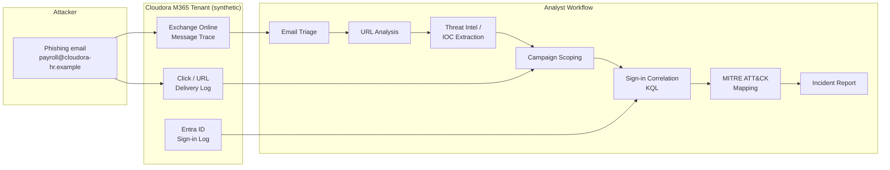
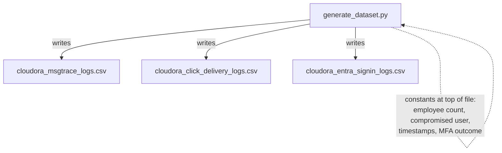
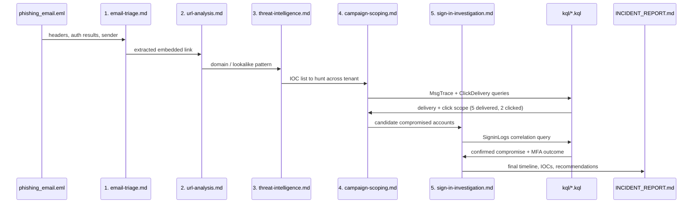
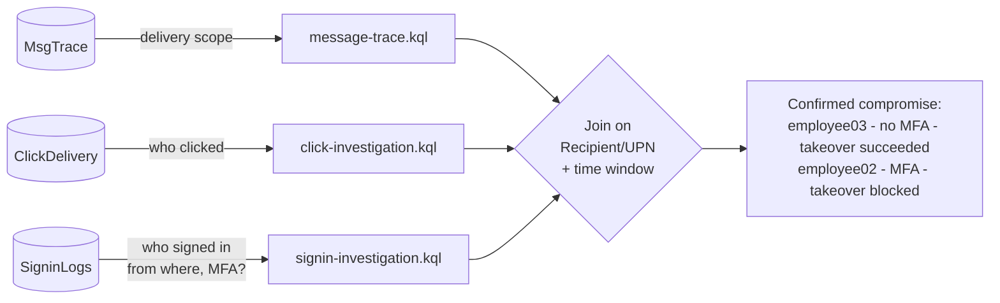
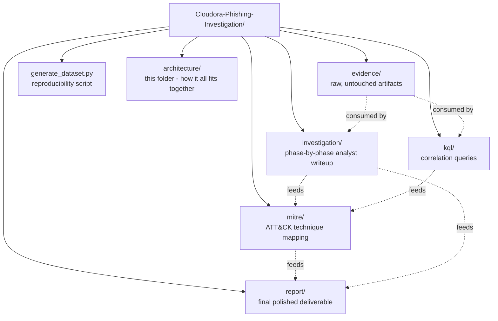

# Architecture

This document explains **how the investigation was built and how it works**
— the data flow, the analysis pipeline, and the repo layout — as opposed to
`report/INCIDENT_REPORT.md`, which explains **what was found**.

---

## 1. System overview

The lab simulates a real M365 tenant's telemetry and reconstructs the
analyst workflow used to investigate a phishing campaign end-to-end: from
raw email through identity compromise to a final report.

---

## 2. Data architecture

Three independent evidence sources are generated and then correlated. Each
represents a different layer of the M365 stack, which is what makes
cross-source correlation possible.

| Source | File | Represents | Key fields |
|---|---|---|---|
| Email content | `evidence/phishing_email.eml` | The raw lure itself | headers, SPF/DKIM/DMARC, body, embedded URL |
| Mail flow | `evidence/cloudora_msgtrace_logs.csv` | Exchange Online message trace | `MessageId`, `Timestamp`, `SenderAddress`, `RecipientAddress`, `Status` |
| Engagement | `evidence/cloudora_click_delivery_logs.csv` | Safe Links / click telemetry | `Recipient`, `Delivered`, `Clicked`, click timestamp |
| Identity | `evidence/cloudora_entra_signin_logs.csv` | Entra ID sign-in log | `UserPrincipalName`, `IPAddress`, `Location`, `ConditionalAccessStatus`, `AppDisplayName` |

All data is synthetic, generated by [`generate_dataset.py`](../generate_dataset.py):

This keeps the whole scenario **reproducible and tweakable** — change the
constants, rerun the script, get a new variant without hand-editing CSVs.

---

## 3. Investigation pipeline (the analyst workflow)

The `investigation/` folder mirrors the actual order a SOC analyst works a
phishing case, phase by phase. Each phase consumes the previous phase's
output:

**Why this order matters:** each phase narrows scope using evidence from
the last one — you don't jump straight to sign-in logs without first
knowing *which* accounts even received/clicked the email. This mirrors how
real SOC triage avoids drowning in unrelated identity log noise.

---

## 4. Correlation architecture (the KQL layer)

The three CSVs are imported as separate tables and joined on timestamp and
recipient/user identity — this join is the technical core of the whole
investigation, since no single log source proves compromise on its own.

See [`kql/README.md`](../kql/README.md) for the exact table-import mapping
and query order.

---

## 5. Repository architecture

The repo itself is structured to separate **raw evidence**, **analysis**,
**detection logic**, and **deliverables** — the same separation a real SOC
case file would keep, so each artifact type can be reviewed independently.

| Folder | Role | Analogy |
|---|---|---|
| `evidence/` | Immutable source data | Chain-of-custody evidence locker |
| `investigation/` | Working analysis, phase by phase | Analyst's case notes |
| `kql/` | Reusable, re-runnable detection logic | The "how we proved it" layer |
| `mitre/` | Threat-model translation of findings | CTI framework mapping |
| `report/` | Stakeholder-facing output | The deliverable a client/manager reads |
| `architecture/` | How the pieces connect | System/process design doc (this file) |

---

## 6. Detection takeaway baked into the architecture

The correlation architecture (§4) is deliberately built so that **MFA
status becomes the single decisive variable** distinguishing a blocked
takeover from a successful one — see
[`mitre/ATTACK_MAPPING.md`](../mitre/ATTACK_MAPPING.md) §"Why MFA mattered
here" for the control mapping (M1032).
